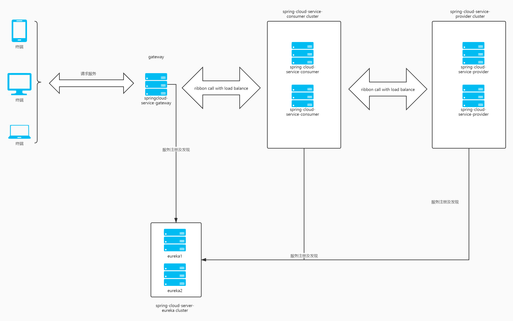

# SpringCloud项目说明文档
edit by [dillinger.io](https://dillinger.io/) markdown online editor

## 技术架构图
**如果展示不出来项目根目录有源文件**



## 模块说明

### spring-cloud-eureka-server
该模块依赖了spring-cloud框架中的eureka组件，用于做注册中心使用。如机构图上的gateway,consumer,provider都会向该模块实例进行服务的注册与发现。
### spring-cloud-service-auth
该模块旨在为其他模块提供用户鉴权功能，目前只依赖了jwt组件，通过maven将jwt的支持传递到其他模块调用。这里未来可以引入spring-cloud中的组件提供更深层次的鉴权。
### spring-cloud-service-consumer
该模块在系统中为服务的使用者，依赖了eureka-client组件，在该模块实例启动时。程序会向配置好的注册中心地址进行注册，gateway在接收到用户请求时会寻找对应的consumer实例进行转发.<br>
在系统中，只有该模块可以被网关访问到。consumer内的接口会通过ribbon去访问provider的接口。

### spring-cloud-service-gateway
该模块为网关模块，具体功能依赖于spring-cloud-gateway实现，同时依赖了ribbon实现负载均衡地调用consumer。
目前路由的配置是通过com.airong.springcloud.service.gateway.route.RouteConfig类硬编码实现的。目前只配置了到consumer的路由，需要添加新的路由可以参考现有代码进行配置。
有需要动态更新路由的可以参考https://blog.csdn.net/zhuyu19911016520/article/details/86557165

### spring-cloud-service-provier
该模块为服务的提供者，被consumer所调用。

## 环境搭建
**以下提到的注册中心，eureka指spring-cloud-eureka-server模块实例；gateway，网关指spring-cloud-service-gateway实例；服务消费者，consumer指spring-cloud-service-consumer实例；服务提供者,provider指spring-cloud-service-provider实例.**

### 软件环境要求
jdk1.8+
maven3.5.2+

### 网络参数
|application|port|
|:-|:-|
|gateway|16001|
|consumer|19001,19002|
|provider|18001,18002|
|eureka|17001,17002|


因为eureka及其他依赖注册中心的模块中的serviceUrl填写的主机名为eureka-server1和eureka-server2，所以还需要修改hosts将eureka-server1,eureka-server1主机名指向到本机ip。<br/>
like this.
> 127.0.0.1 eureka-server1
> 127.0.0.1 eureka-server2

### 编译
于spring-cloud-demo目录下执行 mvn clean install，等待依赖下载完毕之后编译成功。

### 启动
**正常来说启动顺序是eureka在前其他的服务如consumer,provider,gateway相继启动；当然，会有eureka比其他服务启动慢的场景，这个时候其他服务会有connect refuse的异常。不必担心，等到注册中心启动好之后就会正常了。**

编译成功之后 在除了auth模块外的其他模块target目录下会生成sprig-cloud-*-*.jar的文件。按下方提供的启动指令分别启动程序,启动之前检查16001,17001,17002,18001,18002,19001端口是否被占用。如果被占用修改对应端口所使用的项目下的application*.yml文件，如果是修改eureka，需要把gateway,consumer,provider中的defaultZone里的端口配置更新

**启动eureka**

java -jar -Dspring.profiles.active=instance1 spring-cloud-eureka-server-1.0-SNAPSHOT.jar
java -jar -Dspring.profiles.active=instance2 spring-cloud-eureka-server-1.0-SNAPSHOT.jar 

**启动gateway**
java -jar spring-cloud-service-gateway-1.0-SNAPSHOT.jar

**启动consumer**
java -jar -Dspring.profiles.active=instance1 spring-cloud-service-consumer-1.0-SNAPSHOT.jar
java -jar -Dspring.profiles.active=instance2 spring-cloud-service-consumer-1.0-SNAPSHOT.jar

**启动provider**
java -jar -Dspring.profiles.active=instance1 spring-cloud-service-provider-1.0-SNAPSHOT.jar
java -jar -Dspring.profiles.active=instance2 spring-cloud-service-provider-1.0-SNAPSHOT.jar

---
### 服务状态查看及接口的调用

程序启动之后可以通过一下网址访问eureka的面板,里面包括实例信息、注册到eureka的客户端信息、注册中心集群有效&失效实例和内存使用情况。<br/>
http://localhost:17001 http://localhost:17002

接口的调用通过gateway来访问，调用公式是 protocol://gateway-host:port/remote-appname/api-path。
举个例子来说如果我要通过gateway访问consumer中的/demo/port接口。那么我的请求url就是下面这样：
http://localhost:16001/spring-cloud-service-consumer/demo/port

### 现有API迁移
可以根据现有状况去拆分模块，每个模块作为一个单独的eureka-client。以现有框架举个例子来说，如果有用户服务，交易服务，消息服务,查询服务。用户依赖于交易，消息和查询服务。那么这个时候就可以把用户服务的API迁移到spring-cloud-service-consumer工程，其他的交易，消息，查询服务则迁移到spring-cloud-service-provider工程。再通过套用上面的请求公式换算出具体的请求公式并参考项目中已有的请求实例代码开发，一个API迁移就算是完成了。
当然，用户、交易、消息和查询四个服务也可以拆分出四个eureka-client，届时其中有对外开放的服务更新网关的路由配置即可。
如果上面说的不够清楚，可以再看看下面的示例代码；

```java
/**
  * 这里模拟是现有API
  */
public class UserController {
    
    @Autowired
    private UserService userService;
    
    @Autowired
    private OrderService orderService;
    
    @PostMapping("/order")
    public boolean order(OrderRequestModel reqModel) {
        User user = userService.getCurrentUser();
        return orderService.order(user,reqModel);
    }
}

@Service
public class OrderService {
    
    @Autowired
    private OrderRepository orderRepository;
    
    public boolean order(User user,OrderRequestModel orderRequestModel) {
        return ordeRepository.order(user,orderRequestModel);
    }
}

```
以下是迁移后的代码

**user module**
```java
/**
  * user-service module
  * eureka instance name = user-service
  */
public class UserController {
        
    @Autowired
    private UserService userService;
    
    @Autowired
    private OrderServiceClient orderServiceClient;
    
    public boolean order(User user,OrderRequestModel orderRequestModel) {
        User user = userService.getCurrentUser();
       return orderServiceClient.order(user,reqModel);
    }
}

@Component
public class OrderServiceClient {
    
    @Bean
    @LoadBalance
    public RestTemplate getRestTemplate() {
        return new RestTemplate();
    }
    
    @Autowired
    private RestTemplate restTemplate;
    
    public boolean order(User user,OrderRequestModel orderRequestModel) {
        return restTemplate.exchange("http://order-service/api/order",HttpMethod.POST,getHttpRequestEntity(),new ParameterizedTypeReference<Boolean>(){}).getBody();
    }
}
```
---
** order module**
```java
/**
  * order-service module
  * eureka instance name = order-service
  */
public class OrderController {
        
    @Autowired
    private UserService userService;
    
    @Autowired
    private OrderService orderService;
    
    @PostMapping("/api/order")
    public boolean order(User user,OrderRequestModel orderRequestModel) {
       return orderService.order(user,reqModel);
    }
}

@Service
public class OrderService {

    
    public boolean order(User user,OrderRequestModel orderRequestModel) {
        // do something
        return false;
    }
}
```